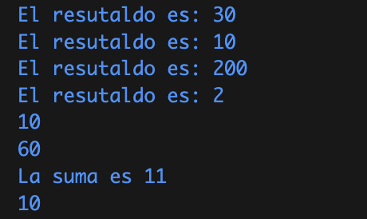

# U2-T11: Complemento Flutter

Portafolio de evidencias para la clase Desarrollo de Dispositivos Inteligentes

## Ejercicios del 01 al 04

### **01.Hello World**

- Código

  ```dart
  void main() {
  print("Hello Word");
  }
  ```

- Captura
  

### **02.Variables**

- Código

  ```dart
  int counter;
  String name;
  double note;
  bool isAdult;
  ```

- Captura
  

### **03.Maps**

- Código

  ```dart
  // Crear un maps
  Map<String, int> verduras = {
   'Cilantro': 1,
   'Zanahoria': 3,
   'Apio': 5,
   'Coliflor': 2
  };
  print(verduras);
  ```

- Captura

  

### **04.List, maps and Iterables**

- Código

  ```dart
   var numeros = [1, 3, 6, 8, 7];

   for (var i in numeros) {
    print(i);
   }

   numeros.forEach((i) {
    print(i);
   });

   Map<String, int> verduras = {
    'Cilantro': 1,
    'Zanahoria': 3,
    'Apio': 5,
    'Coliflor': 2
   };

   for (var verdura in verduras.entries) {
    print("${verdura.key} : ${verdura.value}");
   }
  ```

- Captura

  
  

## Ejercicios del 05 al 08

### **05.Functions**

- Código

  ```dart
  var suma = (int a, int b) {
   return a + b;
  };
  ```

- Captura
  

### **06.Classes**

- Código

  ```dart
  class Vehiculo {
   String marca;
   int year;

   Vehiculo(this.marca, this.year);

   void mostrarDetalles() {}
   }
  ```

- Captura

### **07.Constructors and names**

- Código

  ```dart
   // Constructor
   Coche(this.marca, this._modelo, this._year);

   // Constructor con marca
   Coche.soloMarca(this.marca) {
       _modelo = 'Desconocido';
       _year = 0;
   }
  ```

- Captura

### **08.get and set**

- Código

  ```dart
   // Getters
   String get modelo => _modelo;
   int get year => _year;

   // Setters
   set nombre(String modelo) {
    _modelo = modelo;
   }

   set edad(int year) {
    _year = year;
   }
  ```

- Captura

## Ejercicios del 09 al 15

### **09.Abstract class**

- Código

```dart
   abstract class Figura {
       double calcularArea();
   }

   class Circulo extends Figura {
       double radio;

       Circulo(this.radio);

       @override
       double calcularArea() {
           //pi * radio*radio
           return 3.14 * radio * radio;
       }
   }

   class Rectangulo extends Figura {
       double ancho, alto;

       Rectangulo(this.ancho, this.alto);

       @override
       double calcularArea() {
           //ancho*alto
           return ancho * alto;
       }
   }
```

- Captura

### **10.Mixins**

- Código

       ```dart

  //Definir un mixin
  mixin Volador {
  void volar() {
  print("Estoy volando");
  }
  }

  mixin Corredor {
  void correr() {
  print("Estoy corriendo");
  }
  }

  class Pajaro with Volador, Corredor {}

  ```

  - Captura:

  
  ```

11. ### Futures

    - Código:

    ```dart
    void main() {
        print("");
        print("Inicio del programa");

        Future(() {
            return 'Hola mundo!';
        }).then((resultado) {
            print(resultado);
        });

        print("Fin del programa");
    }
    ```

- Captura

### **11.Futures**

- Código

  ```dart
   void main() {
       print("");
       print("Inicio del programa");

       Future(() {
           return 'Hola mundo!';
       }).then((resultado) {
           print(resultado);
       });

       print("Fin del programa");
   }
  ```

- Captura

### **12.Async Await**

- Código

  ```dart
  void main() async {
      print("Inicio del programa");

      String resultado = await Future(() {
          return "Hola mundo!";
      });

      print(resultado);
      print('Fin del programa');
  }
  ```

- Captura

### **13.Try catch finally**

- Código

  ```dart
  void main() {
      try {
          //int resultado = 10 ~/ 2; //Resultado
          int resultado = 10 ~/ 0; //Error
          print("El resultado es $resultado");
      } catch (e, s) {
          print("Se produjo una excepción $e");
          print("Su descripción es $s");
      } finally {
          print("Procura no dividir entre cero");
      }
  }
  ```

- Captura

### **14.Streams**

- Código

  ```dart
  void main() {
      Stream<int> stream =
          Stream<int>.periodic(Duration(seconds: 1), (count) => count)
              .take(5); //Stream.periodic
      stream.listen((data) => print('Data recibida: $data'));

      Stream<int> otroStream = Stream.fromIterable([6, 7, 8, 9, 10]);
      otroStream.listen((data) {
          print("Data recibida: $data");
      });
  }
  ```

- Captura

### **15.Stream await**

- Código
  ```dart
    void main() async {
    Stream<int> stream =
        Stream.periodic(Duration(seconds: 1), (contador) => contador)
            .take(5); //Stream periodic
    await for (var data in stream) {
        print("Data recibida: $data");
    }
    }
  ```
- Captura

## Aplicación HelloWorld

- Código
- Captura

## Aplicación YesOrNo

- Código
- Captura
